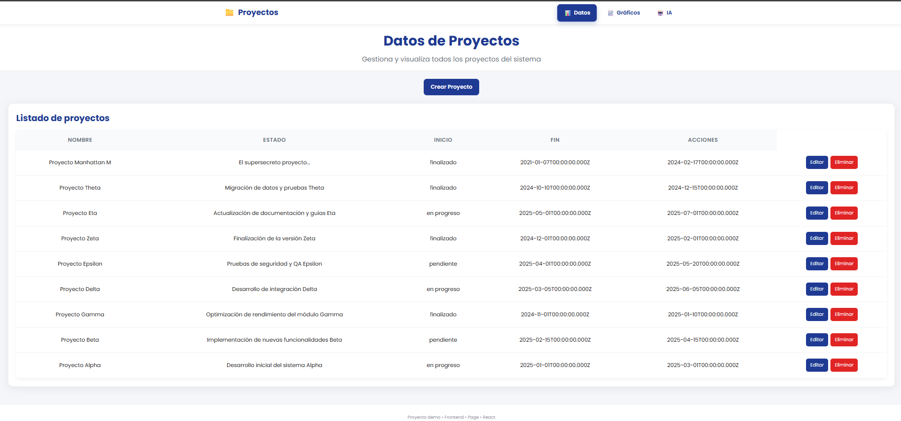
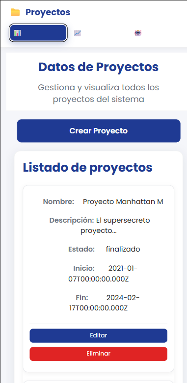
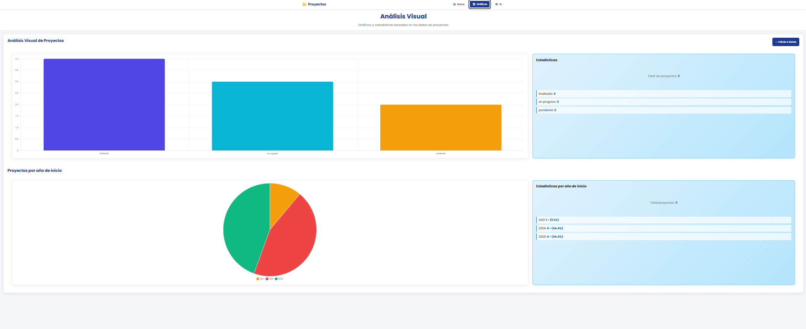
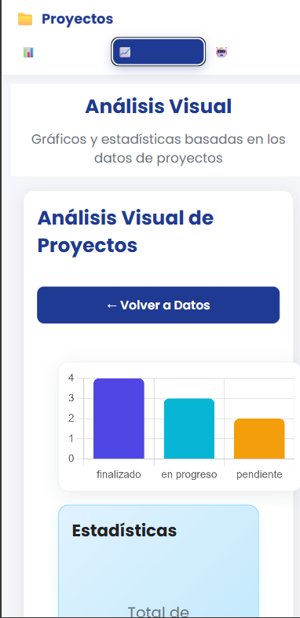
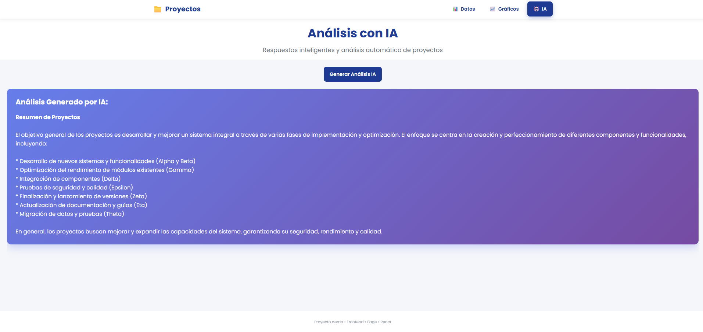
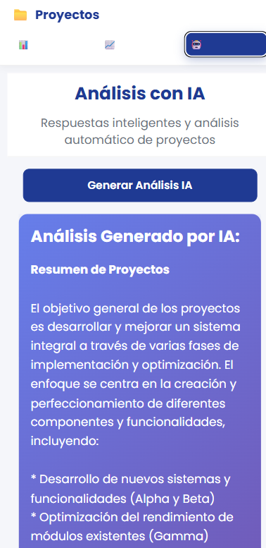

# Prueba-project — Frontend (Vite + React)

Descripción
- Interfaz web para gestionar proyectos y visualizar reportes.
- Construido con Vite, React, Chart.js (react-chartjs-2) y CSS modular.
- Consume la API del backend en `/api/proyectos`.

## 🖼️ Preview de la Aplicación

- Dashboard






- Graphics






- Analysis con IA







Prerequisitos
- Node.js >= 16
- npm o yarn
- Backend corriendo y accesible (ver backend/README)

Variables de entorno
- Crear un archivo `.env` en este directorio con al menos:
```
VITE_API_URL="http://localhost:3000/api/proyectos"
```
- Vite expone variables que empiezan con `VITE_`.

Instalación
```powershell
cd c:\Users\jeffe\Desktop\Prueba-project\frontend\vite-project
npm install
```

Desarrollo (hot-reload)
```powershell
npm run dev
# Abrir la URL que imprime Vite, por defecto http://localhost:5173
```

Construir para producción
```powershell
npm run build
# Servir la carpeta dist con su servidor estático favorito
```

Scripts útiles
- npm run dev — modo desarrollo
- npm run build — generar build de producción
- npm run preview — ver build localmente (Vite)

Estructura relevante
- src/
  - components/ — Project list, ProjectForm, ProjectReport (charts)
  - services/api.js — funciones para consumir la API (`listar`, `crear`, `obtenerGraficos`, ...)
  - styles/ — CSS del proyecto (ProjectForm.css, ProjectReport.css, etc.)
  - main.jsx / App.jsx — punto de entrada y routing

Cómo funciona el dashboard de reportes
- `ProjectReport.jsx`:
  - Muestra gráfico de barras con conteo de proyectos por estado.
  - Muestra gráfico tipo torta con distribución por año según `fechaInicio`.
  - Espera que el endpoint `/graficos` retorne preferiblemente:
    ```json
    {
      "totalProyectos": 9,
      "data": [{ "estado": "En progreso", "count": 4 }, ...],
      "yearData": [{ "year": "2024", "count": 5 }, ...]
    }
    ```
  - El componente normaliza diferentes shapes si recibe otros formatos.

Tips de depuración
- Problemas de texto invisible en inputs: revisar `src/styles/ProjectForm.css` y variables CSS (`--text`, `--white`).
- Icono de calendario invisible: asegurar reglas para `input[type="date"]::-webkit-calendar-picker-indicator`.
- Errores de Chart.js "Canvas is already in use" — usar `redraw` y/o `key` en los componentes de chart o destruir instancias.
- Ver la respuesta real del backend:
  - PowerShell: curl http://localhost:3000/api/proyectos/graficos
  - DevTools: inspeccionar network / console

Buenas prácticas y mejoras sugeridas
- Añadir `prettier`/`eslint` y reglas compartidas con backend.
- Externalizar estilos repetidos a variables CSS (:root).
- Añadir tests para componentes (React Testing Library).
- Mover lógica de normalización de datos del componente a `services/api.js` si se desea centralizar.

📄 Licencia
Este proyecto es parte de una prueba técnica y está bajo licencia MIT.

👤 Autor
Jefferson Lizarazu.

GitHub: jeffersonlizarazu07.
Email: jeffersonlizarazu@hotmail.com.


Última actualización: Octubre 2024.